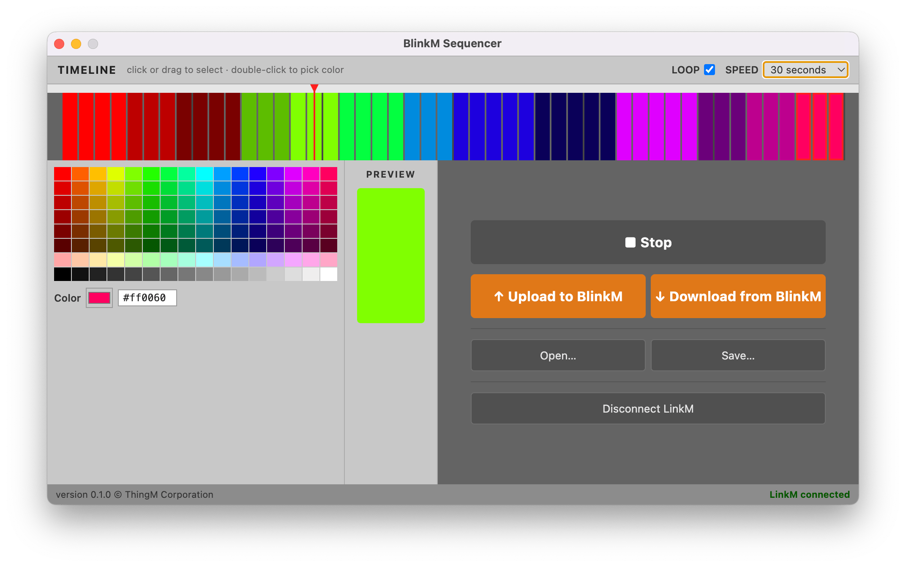

# BlinkM Sequencer

A desktop app for programming [BlinkM](https://thingm.com/products/blinkm/) RGB LED devices. Build a 48-step color animation sequence, preview it in real time, and burn it to the BlinkM's EEPROM so it plays back automatically on power-up.

Connects to a BlinkM via a [LinkM](https://thingm.com/products/linkm/) USB HID adapter — no Arduino or serial port required.



---

## Features

- **48-step color timeline** — click or drag to select steps, double-click to open the OS color picker, or pick from the swatch palette
- **Live hardware preview** — colors are sent to the BlinkM in real time as you edit and during playback
- **Playback** — animated playhead with loop and three speed settings (3 s / 30 s / 120 s)
- **Upload to BlinkM** — burns the sequence to EEPROM; BlinkM plays it automatically on every power-up
- **Download from BlinkM** — reads the sequence currently stored in EEPROM back into the editor
- **Open / Save** — load and save sequences as `.json` files

---

## Requirements

- A [BlinkM](https://thingm.com/products/blinkm/) RGB LED
- A [LinkM](https://thingm.com/products/linkm/) USB HID host adapter (VID `0x20A0`, PID `0x4110`)

---

## Install & Run

```
npm install
npm start
```

To open with DevTools attached:

```
npm run debug
```

---

## Build distributable

```
npm run dist:mac    # macOS DMG (Intel + Apple Silicon)
npm run dist:win    # Windows NSIS installer (x64)
npm run dist        # both
```

> **Note:** `node-hid` is a native module. Build each platform on its own OS — cross-compilation is not reliable for native modules.

---

## File structure

```
BlinkMSequencerElectron/
├── linkm.js      # LinkM USB HID driver + BlinkM I2C command set (no Electron dependency)
├── main.js       # Electron main process — IPC handlers, file I/O, window
├── preload.js    # contextBridge — exposes window.linkm.* API to the renderer
├── renderer.js   # All UI logic — timeline, playback, color picker, upload/download
├── index.html    # UI structure
└── style.css     # Dark theme
```

### `linkm.js` — reusable LinkM/BlinkM driver

A self-contained `LinkM` class with no Electron dependency. Can be used in any Node.js project.

```js
const { LinkM } = require('./linkm');
const lm = new LinkM();          // optional I2C address arg, default 0x09
lm.connect();                    // opens first found LinkM
lm.fadeToRGB(255, 0, 0);        // send a BlinkM command
lm.on('disconnect', err => {}); // fires on USB unplug / device error
lm.disconnect();
```

**BlinkM commands exposed on `LinkM`:**

| Method | BlinkM cmd | Description |
|---|---|---|
| `fadeToRGB(r, g, b)` | `'c'` | Fade to RGB color |
| `stopScript()` | `'o'` | Stop running script |
| `setFadeSpeed(speed)` | `'f'` | Set fade speed (1–255) |
| `playScript(id, reps, pos)` | `'p'` | Play script; reps=0 loops forever |
| `setScriptLength(id, len, reps)` | `'L'` | Set script length and repeat count |
| `setBootParams(fadeSpeed, reps)` | `'B'` | Configure power-up playback |
| `writeScriptLine(line, ticks, r, g, b)` | `'W'` | Write one EEPROM script line |
| `readScriptLine(line)` | `'R'` | Read one EEPROM script line |

### `main.js` — Electron main process

Owns the `LinkM` instance and exposes it to the renderer via IPC:

| Channel | Direction | Description |
|---|---|---|
| `linkm:connect` | invoke | Open the LinkM device |
| `linkm:disconnect` | invoke | Close the device |
| `linkm:status` | invoke | Returns `{ connected, devicePresent }` |
| `linkm:sendColor` | invoke | Rate-limited fade to color (~33 Hz max) |
| `linkm:preparePreview` | invoke | Stop script, set fade speed for preview |
| `linkm:burn` | invoke | Write full sequence to EEPROM |
| `linkm:download` | invoke | Read full sequence from EEPROM |
| `linkm:status` | push | Sent to renderer on device disconnect |
| `linkm:burnProgress` | push | Upload/download progress `(cur, total)` |
| `seq:save` | invoke | Show save dialog and write JSON file |
| `seq:open` | invoke | Show open dialog and read JSON file |

### Sequence file format

Sequences are saved as plain JSON:

```json
{
  "version": 1,
  "duration": 3,
  "loop": true,
  "colors": [
    { "r": 255, "g": 0, "b": 0 },
    { "r": 0, "g": 255, "b": 0 },
    "..."
  ]
}
```

---

## How the hardware protocol works

The LinkM appears as a USB HID device. All communication uses HID Feature Reports (SET_REPORT / GET_REPORT control transfers). Each report is 17 bytes:

```
buf[0]     = 1       (HID report ID)
buf[1]     = 0xDA   (LinkM start byte)
buf[2]     = cmd    (LinkM command, e.g. 1 = I2C transaction)
buf[3]     = nsend  (bytes to write on I2C bus, including the device address)
buf[4]     = nrecv  (bytes to read back from the I2C bus)
buf[5..16] = payload (zero-padded)
```

The LinkM forwards the payload as an I2C transaction to the BlinkM (default address `0x09`). Protocol details sourced from `linkm-lib.c` and `hiddata.c` in the [LinkM host library](https://github.com/todbot/linkm).

---

## Credits

BlinkM and LinkM are products of [ThingM Corporation](https://thingm.com).
